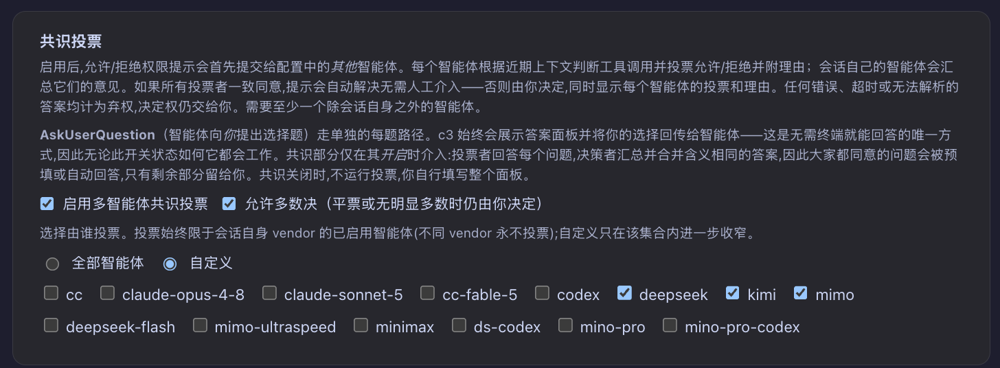

# 多智能体共识投票（Multi-agent Consensus）

> 让多个 agent 先替你投票：能自动定的就自动定，定不了才叫你 —— 在"每一步都要你点确认"的基础上再松一档，把你从连轴的审批里进一步解放出来，更轻松地只等结果。

## 背景：一个人盯着一群 agent 的疲劳

c3 是一个多 agent 的圆桌：你可以同时挂着多个 agent 一起干活。默认情况下，只要某个 agent 要动一次有副作用的工具（写文件、跑命令、发 PR……），权限网关就会**暂停下来问你** allow/deny；agent 通过 `AskUserQuestion` 抛出一道选择题时，也要**等你亲自作答**。

这个"人在环中"的设计保证了安全，但在很多场景里它变成了纯粹的负担：

- **你并不关心执行方案的细节。** agent 要不要执行 `bash`、要不要装某个依赖、选 A 方案还是 B 方案——这些是实现层面的琐事，你只想要最终结果，不想被每一步打断。
- **你不清楚该怎么决策。** agent 抛来一道很专业的选择题（用哪种缓存策略？这个报错要不要忽略？），你其实没有比 agent 更多的信息，硬要你拍板反而是瞎猜。
- **大多数时候"推荐选项"就够了。** agent 给的建议八成是对的，你每次都只是机械地点"同意"，这种确认没有产生任何决策价值。
- **你在离开屏幕。** 想让流程在你去开会、去睡觉的时候继续自动推进，而不是卡在一个简单方案选择决策弹窗上干等几个小时。

这些场景的共同点是：**这一步确实需要一个判断，但那个判断不非得是"你本人"来做。** 你要的是一个"足够可信、又不用你亲自到场"的决策来源。

## 方案：让多个 agent 先投票，达成共识就自动放行

既然圆桌上还坐着其他 agent，为什么不让它们先表决？

多智能体共识的核心逻辑很简单——在把请求丢给你之前，c3 先问一圈**其他** agent：这次工具调用该不该放行？这道选择题该选哪个？

- 每个投票 agent 以一次性、**禁用所有工具**的方式，仅凭最近上下文做判断，投出 allow/deny（或选出选项）并附上理由；
- 会话自己的 agent 担任 **decider（裁决者）**，把大家的意见汇总成一句话摘要；
- 如果达成共识，请求**自动决议、无需你出面**；达不成共识，才回落到你这里，并把每个 agent 的票和理由一并展示给你，帮你更快决策。

它有几条刻在骨子里的安全底线，理解它们你才敢放心开：

1. **永远可回落到人。** 任何投票出错、超时、答案无法解析，都记为**弃权**；弃权就不算一致，于是这道题重新交回你手上。共识只会"帮你省掉能确定的那部分"，绝不会替你冒险拍板。
2. **至少要有一个"别人"。** 如果除了会话自己没有其他 agent 可投票，共识会被跳过，照常问你。
3. **自动决策留痕可追溯。** 每一次无人参与的自动决议都会在工作台（WorkCenter）的"自动"筛选下留下一条**仅审计、不阻塞**的记录，事后可查是谁、在何时、依据什么投票放行的。

共识不仅覆盖 allow/deny 的工具权限，还覆盖 `AskUserQuestion` 的**逐题作答**，以及自动化编排里的**检查点**（让流程 `继续` 还是 `等待`人工）——同一套投票 agent，同一条回落到人的底线。

## c3 里怎么配

在工作区（Workspace）的 Consensus 区块里, 共识由三个开关控制，从"开不开"到"怎么算通过"再到"谁来投"，逐层收窄。

### 1. 启用多智能体共识投票

> **启用多智能体共识投票**

总开关，默认**关闭**。打开后，才会在问你之前先发起一轮投票。

- 关闭时：一切照旧，每个敏感工具调用、每道选择题都直接问你。
- 打开时：先投票；**全体一致**才自动决议，否则仍然交给你（附带各 agent 的意见）。

这是最保守、也最推荐的起点：即使全开，只要投票者有任何分歧，最终决定权仍在你手里。

### 2. 允许多数决（平票或无明显多数仍交由你决定）

> **允许多数决（平票或无明显多数时仍由你决定）**

第二个开关，默认**关闭**，只有在共识已启用时才有意义。它决定"多一致才算通过"：

- **关闭（默认）= 仅全体一致。** 只有当**每一个**投票者都投了相同结果，才自动决议。任何分歧、弃权，都回落到你。
- **打开 = 允许多数派裁决。** 弃权不计票，**严格多数**即可决议（allow 多于 deny 则放行，反之则拒绝）。但**平票**（例如 2:2）、**没有明显多数**、或**全体弃权**时，仍然**交由你决定**——安全底线不变。

打开多数决会明显提升自动化率（不必强求人人意见一致），代价是决策不再要求全票。c3 会在结果里诚实区分"所有 agent 一致…"与"多数派裁决…"，让你一眼看出这一票是怎么来的。

> 多数决这个开关还会顺带启用自动化编排的**检查点共识**：当开发循环判定卡住、或有一道未答的选择题时，同一批 agent 会投票决定流程该 `继续` 还是 `等待`人工。关闭多数决时，检查点永远不会触发共识，照走原有的"停下等人"路径。

### 3. 谁来投票

> **选择由谁投票。投票始终限于会话自身 vendor 的已启用智能体(不同 vendor 永不投票);自定义只在该集合内进一步收窄。**（全部 agent / 自定义）

在工作区（Workspace）的 Consensus 区块里，用一个 `全部 agent，默认 / 自定义` 单选决定投票者范围。

- **全部 agent，默认**：** 除会话自己以外的每一个已启用 agent 都参与投票。
- **自定义：** 从一份"已启用 agent 勾选清单"里挑出**允许投票的子集**。适合用来：
  - 排除那些只读的、跟决策无关的 agent；
  - 只把票权交给你信任度更高的少数几个 agent。

  自定义清单只做"缩小"，且被双重过滤——已禁用/已不存在的 agent 会被清出清单，运行期投票集又只从"已启用的 agent"重建，所以一个失效的 id 不可能复活成投票者。若自定义清单最终为空（一个可投票 agent 都不剩），共识会被跳过，照常问你。

## 建议的开启节奏

1. **先只开总开关（全体一致）。** 感受一下哪些原本要你点确认的操作，现在被"全票通过"自动放行了——这是零风险的自动化红利。
2. **需要更快时再叠加多数决。** 当你发现总有一两个 agent 因为口味不同拖住全票、而多数意见其实很清晰时，打开多数决换取更高的自动化率；平票和没有明显多数仍会回到你，底线不丢。
3. **用 自定义精修投票团。** 若圆桌里有只读或不专业的 agent 在稀释票池，切到 自定义，只保留你信得过的几个 agent。

无论怎么配，记住那条不变的承诺：**能确定的，共识替你自动定；一旦有真正的分歧，方向盘永远还在你手上。**
