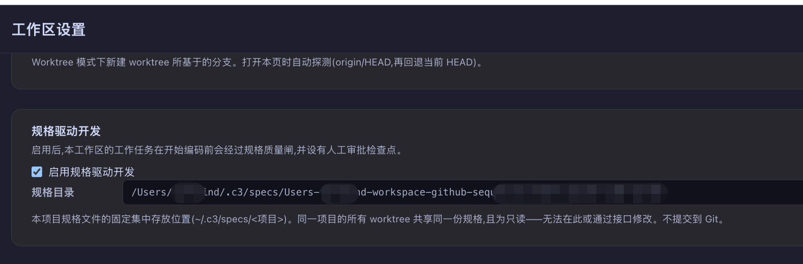

# 规范驱动开发（Spec-Driven Development, SDD）

AI 智能体写代码又快又多，但"写得快"不等于"写得对"。**规范驱动开发（SDD）**的做法是：在智能体动手编码之前，先产出一份**人可评审的规范文档（spec）**，经人工批准后才进入开发——把人的把关点从"读代码"前移到"读文档"。本文分两部分：**第一部分**讲清楚 SDD 的背景、好处和适用场景；**第二部分**介绍在 c3 中如何开启 SDD，以及 SDD 模式下的完整开发流程。

> 建议先阅读[从需求到意图](requirement-to-intent.md)——SDD 建立在意图之上：意图回答"做什么、为什么"，规范回答"具体改成什么样、怎么验证"。

---

## 一、什么是规范驱动开发

### 背景：AI 编码时代的新问题

AI 智能体成为执行主体后，出现了一个传统软件工程没有的失衡：**生产代码的速度远远超过了人审查代码的速度。**

#### 1. 从意图直接到代码，中间有一段"跳跃"

一个写得很好的意图说清了 Why / What / Acceptance，但对于复杂变更，从意图到代码之间还有大量**设计决策**：接口契约怎么定、数据怎么迁移、失败了怎么处理、兼容性怎么保证。如果这些决策全部由智能体在编码过程中即兴做出，人只能在事后从几百行 diff 里反推"它到底做了什么决定"——这时候纠正的成本已经很高。

#### 2. 评审代码贵，评审文档便宜

人读一份 500 行的 PR 需要很强的专注力，还常常看不出设计层面的问题；而读一页说清"改什么行为、边界在哪、怎么验证"的文档只要几分钟。**把关点越靠前，纠错成本越低**——这是所有工程评审实践的共同逻辑，SDD 只是把它应用到了"人机分工"上。

#### 3. "凭感觉编码"（vibe coding）缺少可追溯的依据

一句话 prompt 直接生成大量代码，事后没人说得清"当时约定的行为是什么"。代码合并后，设计意图散落在聊天记录里，下一个维护者（无论人还是智能体）看到"奇怪"的实现时无从判断是深思熟虑还是随手为之。

#### 4. 自动化开发需要一道质量闸

当你允许智能体**自主**开发（无人盯屏、自动提交），风险不再是"改错一行"，而是"沿着错误的方向做完了整件事"。自动化流水线需要一个机制保证：进入开发的每个任务，其方案都经过了人的确认。

### SDD 是什么

规范驱动开发的核心约定只有三条：

1. **先规范，后编码。** 每个开发任务在动手前先产出一份规范文档，说清可观察的行为变化、边界、关键决策和验证方式。
2. **人工批准是进入开发的闸门。** 规范必须经人评审批准，未批准的任务不能开始编码——无论是手工启动还是自动化编排。
3. **规范是唯一事实来源（Spec is Truth）。** 开发过程以规范为准；实现中发现规范有误或需要偏离时，不是悄悄绕开，而是**先改规范（反向同步，Reverse Sync）**，让文档与代码始终一致。

围绕这三条，SDD 模式下的开发智能体遵循一套工作契约：**Spec is Truth**（以规范为准）、**Restate First**（动手前先复述理解）、**Checkpoint Before Execute**（关键节点先过检查点）、**Done by Evidence**（以证据判定完成，而非自我宣告）、**Reverse Sync**（实现与规范分歧时反向同步规范）、**Ask for Clarification**（有歧义就提问而不是猜）。

一句话总结：

> **意图是"要做什么"的契约，规范是"具体做成什么样"的契约；SDD 把人的把关放在纠错成本最低的阶段——文档阶段。**

### SDD 的好处

1. **把关点前移，纠错成本最低。** 方向性错误在文档阶段被发现，改一段话；在代码阶段被发现，改一个 PR；在上线后被发现，改一次事故。
2. **评审不需要读代码。** 一份好的规范让评审者**不读代码库也能判断批准还是驳回**——这正是"AI 执行、人把关"分工得以成立的前提。
3. **决策有据可查。** 规范记录了行为约定、边界与取舍，与意图、开发会话、代码分支串成完整链路，可追溯、可审计。
4. **代码与文档不漂移。** "规范是唯一事实来源 + 反向同步"从机制上保证文档跟着实现走，而不是合并后就过期。
5. **自动化的安全带。** 有了"规范已批准"这个可检查的门禁条件，自主开发循环（自动拾取任务 → 开发 → 提交）才敢真正放手运转。

### 适用场景

SDD 是一道质量闸，闸门有成本（多一轮撰写和评审）。它**不是越多越好**，而是按项目和变更的风险来权衡：

**适合开启 SDD 的场景：**

- 变更涉及**接口契约、持久化数据、迁移、安全或跨模块影响**——错了很难回头；
- **多人协作**的项目——规范是团队对"要做成什么样"的共识载体；
- 使用**自动化编排**让智能体自主开发——人不在场，闸门就是唯一的把关点；
- 对可追溯性有要求的场景（审计、合规、长期维护）。

**可以不开 SDD 的场景：**

- 小修小补（改个文案、补个校验）——意图本身的 Acceptance 已够把关；
- 实验性探索（spike、原型）——方案本身就是探索目标，先写规范是本末倒置；
- 个人小项目快速迭代——人自己就在回路里，闸门收益有限。

在 c3 中，SDD 是**工作区级开关**：同一个 c3 里，重要项目开、实验项目关，互不影响。

---

## 二、c3 中的 SDD 配置与开发流程

在 c3 中，SDD 作为一等工作流内建于[意图](requirement-to-intent.md)的开发链路：开启后，每个意图必须先产出规范（spec）并经你批准，才能进入开发。

```
意图（todo）
   │
   ▼
编写规范（Write Spec）──► 写入受限的规范会话产出 spec.md
   │                        （可反复细化 / 重置重写）
   ▼
批准规范（Approve Spec）──► 人工检查点：你在规范文档页点击批准
   │
   ▼
开始工作（Start Work）──► 服务端强制校验"规范已批准"才启动开发会话
   │                        开发会话以 spec 为唯一事实来源
   ▼
开发完成 → 提交 / PR → 标记 done
```

### 前置条件

- 已完成 [c3 入门指南](c3-get-start.md)中的安装与启动，并创建了指向你项目目录的工作区（Workspace）；
- 已按[从需求到意图](requirement-to-intent.md)创建了至少一个 `todo` 状态的意图。

### 配置 SDD

#### 1. 开启工作区的 SDD 开关

进入**工作区设置（Workspace Setting）**，找到**规格驱动开发**一节，勾选**启用规格驱动开发**。该开关默认关闭，按工作区独立生效。

开启后，该工作区中意图的主操作按钮会变为 SDD 感知的四态按钮（见下文流程），自动化编排器也只会拾取规范已批准的意图。



#### 2. 了解规格目录（只读，无需配置）

开启开关后，设置页会展示本项目的**规格目录**。它是一个**固定的集中位置**：`~/.c3/specs/<项目路径段>`，由服务端从工作区路径确定性解析，**不可配置、不可修改**。这样设计有两个原因：

- **所有 worktree 共享同一份规格。** 规格按项目隔离存放在 c3 主目录下，而不是散落在每个 git 工作副本里——无论意图在哪个 worktree 中开发，读到的都是同一份 spec；
- **规格不提交到 Git。** 它是开发过程的治理文档，不进入代码仓库。

#### 3. 可选：指定规范智能体

在**设置 → 智能体**中可以配置**规范智能体**（负责撰写规范的智能体），默认**跟随默认智能体**。注意：撰写规范的会话是**写入受限**的（见下文），该限制在工具/路径层强制执行，若所配智能体无法建立此边界，启动会被拒绝而不是降级放行。


#### 4. 可选：开发技能（devSkill）

工作区设置中的 `devSkill` 是开发会话的 slash command 前缀。若配置了 devSkill，开发会话按你的技能约定工作；
若未配置，SDD 会自动为开发会话注入内置的**规范驱动工作契约**（Spec is Truth、Restate First、Checkpoint Before Execute、Done by Evidence、Reverse Sync、Ask via Tool）。两者不会叠加，devSkill 优先。

### SDD 开发流程

开启 SDD 后，`todo` 意图的主操作按钮按状态呈现三种动作：无规范 ⇒ **编写规范**；已写未批准 ⇒ **批准规范**；已批准 ⇒ **开始工作**。逐步走一遍：

#### 第 1 步：编写规范（Write Spec）

在意图详情点击**编写规范**。c3 会：

1. 在集中规格目录下创建带日期的规范文档：`~/.c3/specs/<项目>/yyyy/mm/dd/yyyy-mm-dd-<序号>-<意图短标题>.md`，并立即回填到意图上；
2. 启动一个**规范会话**来撰写内容。这个会话的职责**只是写规范，不改代码**：写入被硬性限制在该规范目录内（写别处一律拒绝），项目其余部分只读，shell、子智能体、slash command 全部禁用——和意图沟通智能体一样，约束在工具/路径层强制执行，不靠提示词自觉。它可以只读查询本项目已有的意图，用来对齐上下文、避免与既有约定冲突。

> 在 worktree 模式下，编写规范前会检查该意图的依赖是否都已合并进主线——依赖的代码还没上主线时写出的规范是空中楼阁，此时按钮会禁用并说明原因。

**规范长什么样？** 规范的第一读者是**你**（评审者），第二读者才是开发智能体。它不重复意图里已有的 Why / What / Acceptance，而是开门见山地写：可观察的行为变化、边界、需要拍板的关键决策、验证方式。篇幅与影响面成正比——单点小改动通常只有 8–20 行；涉及契约、数据、迁移、安全或跨域的变更才会展开记录取舍、兼容性与失败处理。规范用领域语言描述能力与契约，**不列文件路径、不点名函数**——那是实现阶段的事。

#### 第 2 步：评审与细化

在意图详情的**规范**标签页阅读生成的 spec。判断标准很简单：**不读代码库，你能否放心地批准或驳回它？**

如果不满意，两种方式继续打磨：

- 在**编写规范会话**标签页里继续对话，让它修改；
- 会话聊得太久已经"糊"了时，点击**重置规范会话**：输入你的新要求，c3 会以"你的输入 + 当前规范路径"新起一个干净的规范会话（同样写入受限），旧会话仍可在 Works 中查看，但不再关联到此意图。

#### 第 3 步：批准规范（Approve Spec）

规范达标后，在**规范文档标签页**点击**批准**。这是 SDD 的核心人工检查点：

- 批准记录**批准人**（当前登录用户），单人确认即生效；
- 为防止误触，规范刚生成后的 10 秒内批准操作不可用；
- 批准**只是放行闸门**，不会自动开始开发——按钮随之变为**开始工作**。

#### 第 4 步：开始工作（Start Work）

点击**开始工作**启动后台开发会话。SDD 在这一步做了三件事：

1. **服务端强制门禁。** 规范未批准的意图无法启动开发——即使绕过界面直接调用也会被服务器拒绝，闸门不依赖前端隐藏按钮；
2. **注入规范路径。** 开发会话的启动信息除了意图标题、内容和依赖说明，还带上已批准 spec 的路径，并声明它是**唯一事实来源**：实现与规范出现分歧时，先反向同步规范；
3. **安装工作契约。** 未配置 devSkill 时，SDD 的规范驱动工作契约作为系统上下文注入开发会话——复述先行、检查点、以证据判定完成、有歧义就提问。

之后就是标准的开发循环：智能体在（可选的）worktree 隔离分支上开发，敏感操作照常经过你的权限审批，完成后提交、推 PR、标记 `done`。

#### 与自动化配合

给意图打上 `automate` 标记并启动自动化编排器时，SDD 开关同样生效：**规范未批准的意图不会被自动化拾取**，排队等你批准后才进入自主开发。这正是 SDD 对自动化的价值——人不在场时，闸门替你把关方向。

### 常见问题

**Q：开了 SDD，每个小意图都要写规范，会不会太重？**

A：规范的篇幅与影响面成正比，单点小改动的规范通常只有十几行，评审一分钟。如果项目里多数变更都是小修小补，也可以直接不开 SDD——它是工作区级开关，按项目权衡。

**Q：规范为什么不放在代码仓库里？**

A：规范是开发过程的治理文档，批准状态、批准人等元数据由 c3 管理；集中存放还能让同一项目的所有 worktree 共享同一份规格集合。如果你希望某些设计结论沉淀进仓库，可以在意图的 Acceptance 里要求开发时同步更新仓库内文档。

**Q：规范会话会不会顺手改了我的代码？**

A：不会。它的写入范围被限制在该规范目录内，其余路径只读，shell 与子智能体被禁用——这些约束在工具/路径层强制执行，无法靠提示词绕过。

**Q：规范批准之后还能改吗？**

A：当前阶段批准是单人确认、不提供"取消批准"。请在批准前用规范会话或重置规范会话充分打磨；开发中发现规范确有问题时，遵循反向同步原则——让开发会话暂停并把分歧交回给你决策。

**Q：SDD 和意图的 Acceptance 是重复的吗？**

A：不重复。Acceptance 写在意图里，回答"满足什么条件算做完"；规范把其中的验收项落成**可观察的验证条件**，并补上意图不涉及的设计决策（契约、边界、兼容、失败处理）。规范不会照抄意图的内容。

## 参考

- [c3 入门指南](c3-get-start.md)
- [从需求到意图](requirement-to-intent.md)
